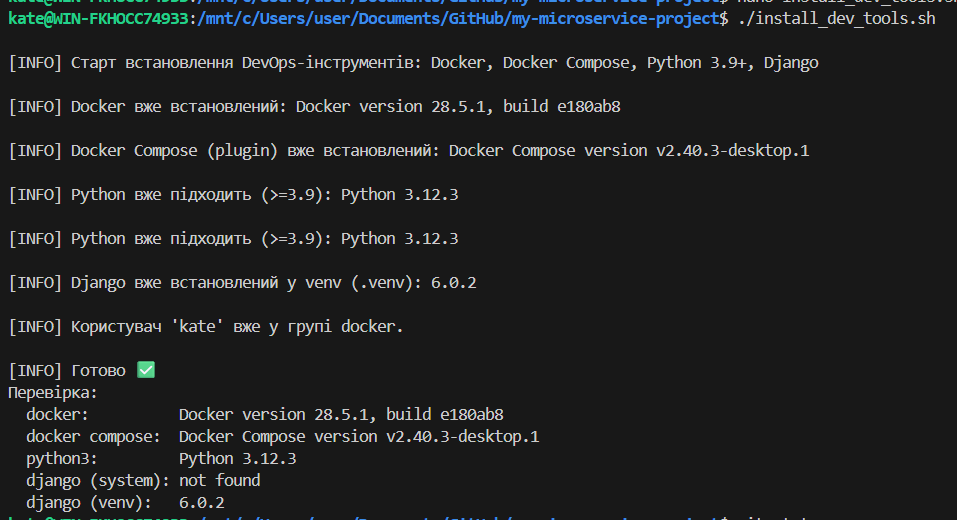

# Мій власний мікросервісний проєкт

Це репозиторій для навчального проєкту в межах курсу "DevOps CI/CD".

## Мета

Навчитися основам роботи з Git і GitHub.

### lesson-3

завдання до теми «Linux адміністрування»

Вітаємо в домашньому завданні до теми «Linux адміністрування»!🐧

Це завдання допоможе вам закріпити знання роботи з Bash-скриптами та системним адмініструванням у Linux. Ви створите скрипт, який автоматизує встановлення необхідних інструментів для роботи DevOps-інженера.

Опис завдання

Створіть Bash-скрипт для автоматичного встановлення Docker, Docker Compose, Python і Django, а також запуште його в GitHub у гілку lesson-3.

Кроки виконання завдання

1. Створіть Bash-скрипт із назвою install_dev_tools.sh, який автоматично:

встановлює Docker,
встановлює Docker Compose,
встановлює Python (версію 3.9 або новішу),
встановлює Django через pip.
☝🏻 Скрипт має перевіряти, чи інструменти вже встановлені, щоб уникнути дублювання.

2. Зробіть скрипт виконуваним командою:

chmod u+x install_dev_tools.sh

3. Запустіть скрипт на своїй системі, щоб переконатися, що всі інструменти встановлені правильно.

./install_dev_tools.sh

4. Запуште скрипт у створену гілку lesson-3 вашого репозиторію на GitHub.

git checkout -b lesson-3
git add install_dev_tools.sh
git commit -m "Add Bash script for installing Docker, Docker Compose, Python, and Django"
git push origin lesson-3

Вирішення:

