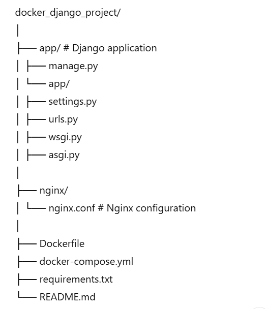
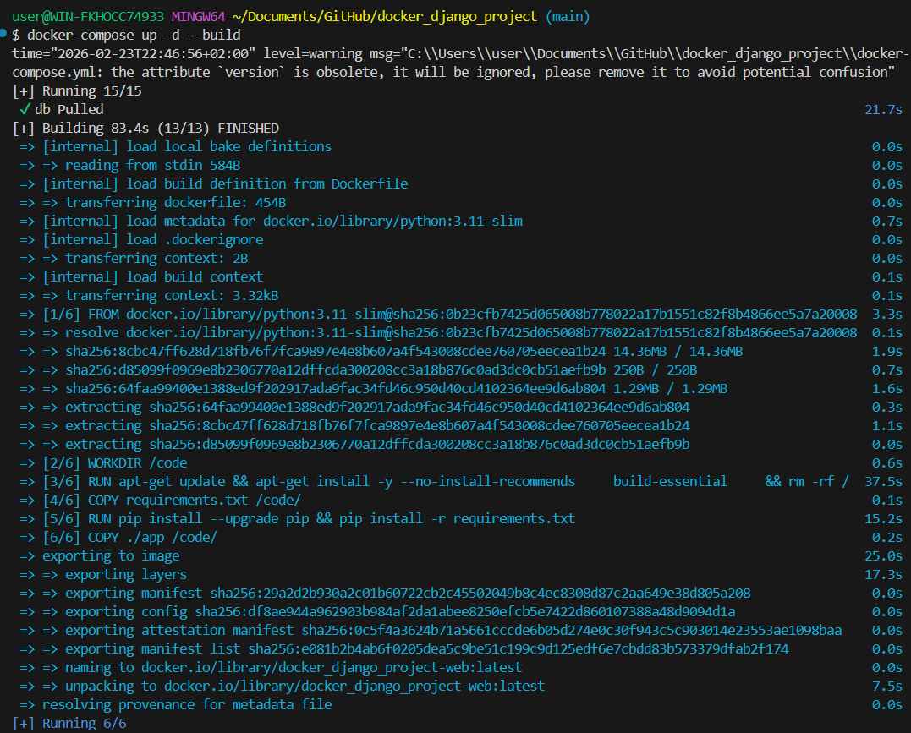
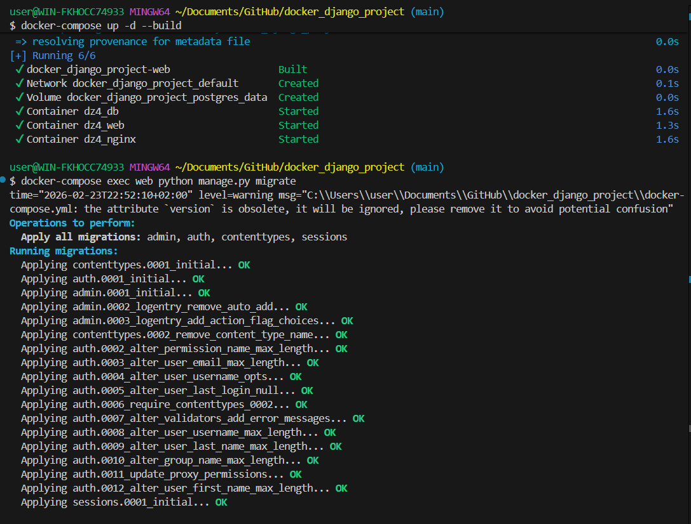
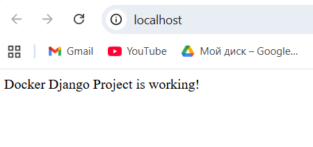

# Dockerized Django Project

This project is a Dockerized Django application with PostgreSQL database and Nginx web server.

## 🐳 Project Stack

- Django 4.2
- PostgreSQL 15
- Nginx
- Docker
- Docker Compose

---

## 📂 Project Structure

## ⚙️ How to Run the Project

1️⃣ Build and start containers:

docker-compose up -d --build

2️⃣ Apply database migrations:

docker-compose exec web python manage.py migrate

3️⃣ Open in browser:

http://localhost

If everything works correctly, you should see:

Docker Django Project is working!

### Database Configuration

The project uses PostgreSQL with the following default credentials:

Database: django_db

User: django_user

Password: django_password

Host: db

Port: 5432

### Services

web — Django application running with Gunicorn

db — PostgreSQL database

nginx — Reverse proxy server

### Useful Commands

View logs:

docker-compose logs -f

Stop containers:

docker-compose down

Rebuild project:

docker-compose up -d --build
