# Final DevOps Project on AWS

Цей репозиторій містить повний фінальний проєкт для розгортання DevOps-інфраструктури на AWS:

- VPC з public/private subnet, IGW, NAT Gateway
- S3 + DynamoDB для Terraform state
- ECR для Docker image
- EKS для Kubernetes
- RDS або Aurora через універсальний модуль
- Jenkins для CI
- Argo CD для GitOps/CD
- Prometheus + Grafana для моніторингу
- Django application + Helm chart

## Архітектура

1. Terraform створює VPC, ECR, EKS, RDS/Aurora, Jenkins, Argo CD, monitoring.
2. Jenkins будує Docker image через Kaniko і пушить в ECR.
3. Jenkins оновлює `charts/django-app/values.yaml` у GitOps-репозиторії `django-gitops`.
4. Argo CD відстежує GitOps-репозиторій і застосовує зміни в EKS.
5. Prometheus і Grafana збирають метрики кластера.

## Використані технології

- AWS
- Terraform
- Docker
- Kubernetes
- Amazon EKS
- AWS ECR
- AWS RDS
- Jenkins
- Argo CD
- Helm
- Prometheus
- Grafana
- GitOps

## Структура репозиторію

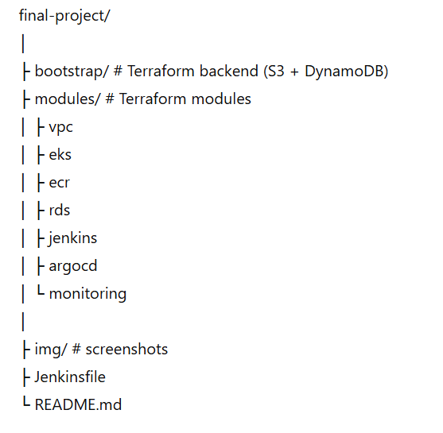

## Важливий порядок запуску

### 1. Bootstrap backend для state

Спочатку створи S3 bucket і DynamoDB table окремо:

cd bootstrap
terraform init
terraform apply -auto-approve

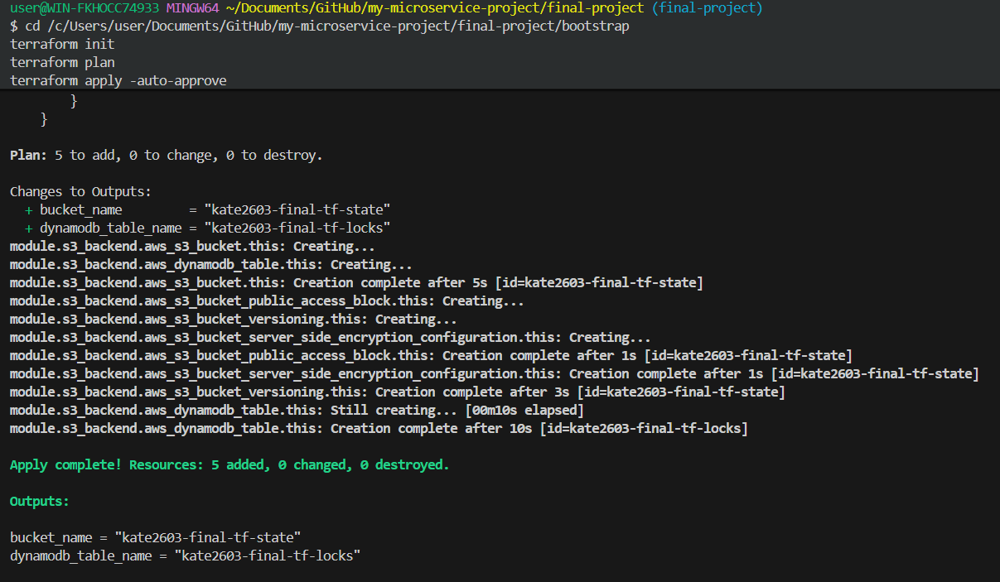

### 2. Основна інфраструктура

cd ..
terraform init -reconfigure
terraform fmt -recursive
terraform validate
terraform plan -out=tfplan2
terraform apply tfplan2

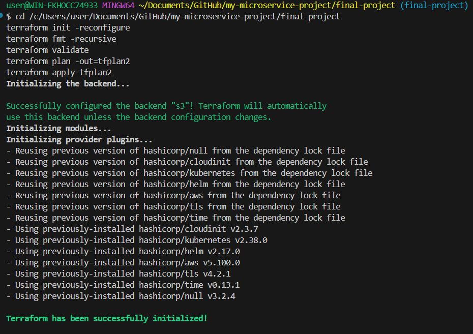

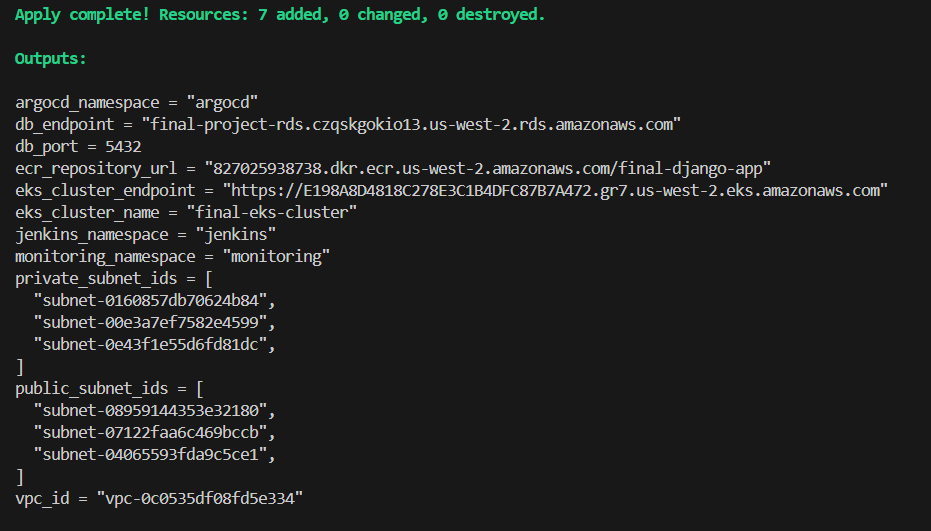

### 3. Оновлення kubeconfig

aws eks update-kubeconfig --region us-west-2 --name final-eks-cluster

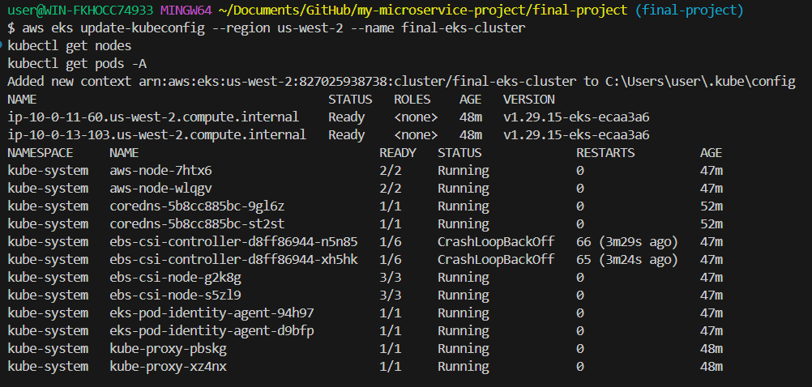

### 4. Перевірка

kubectl get nodes
kubectl get all -n jenkins
kubectl get all -n argocd
kubectl get all -n monitoring

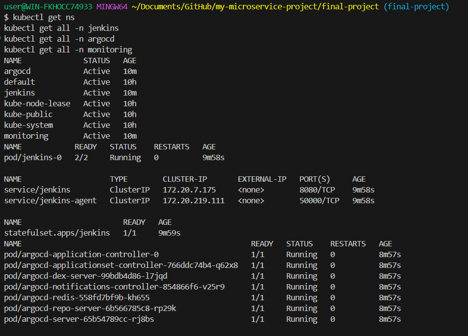

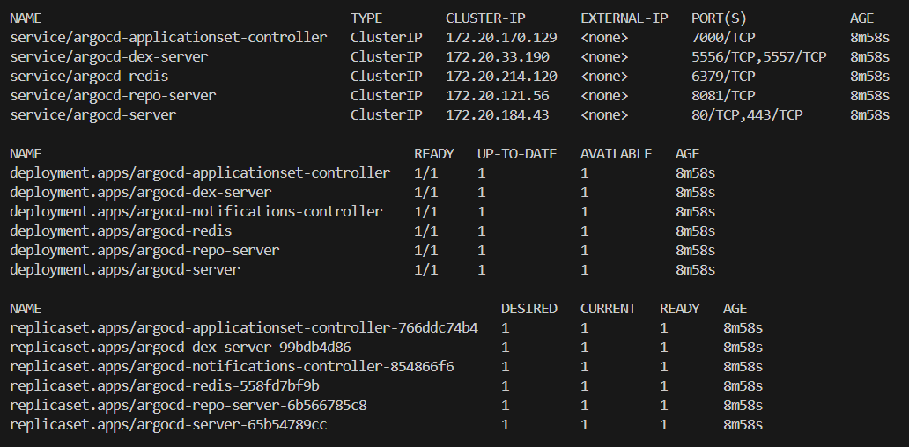

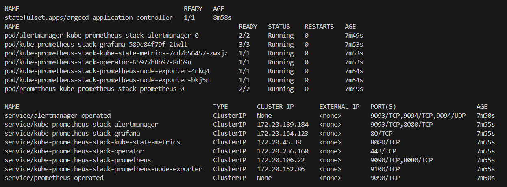

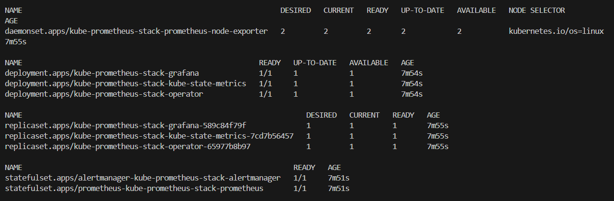

### 5. Порт-форвардинг

kubectl port-forward svc/jenkins 8080:8080 -n jenkins

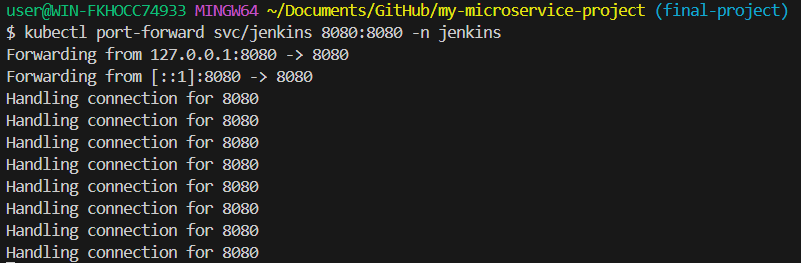

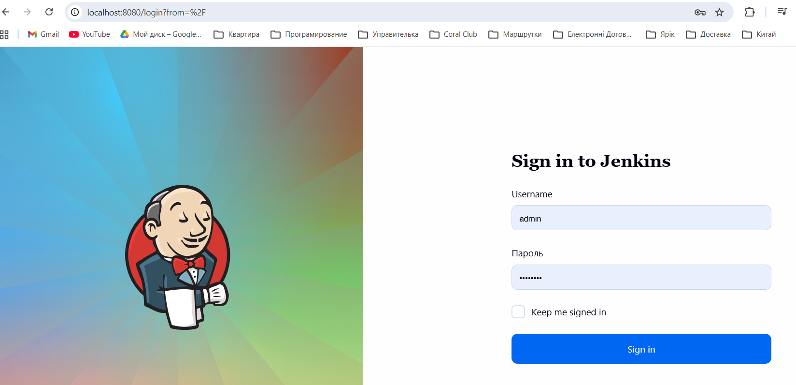

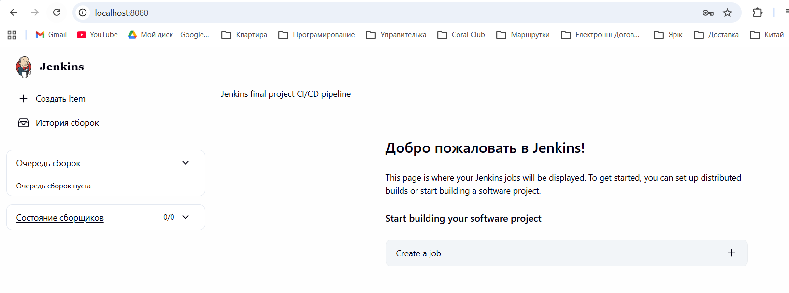

kubectl port-forward svc/argocd-server 8081:80 -n argocd

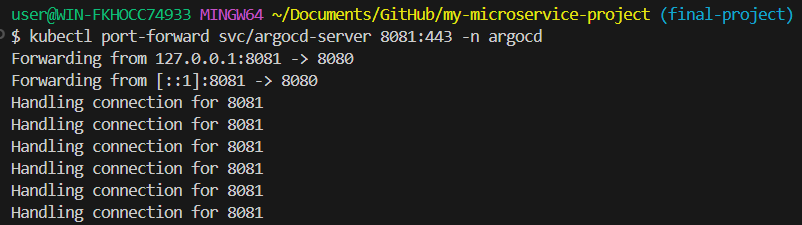

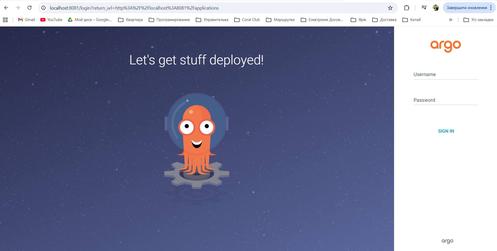

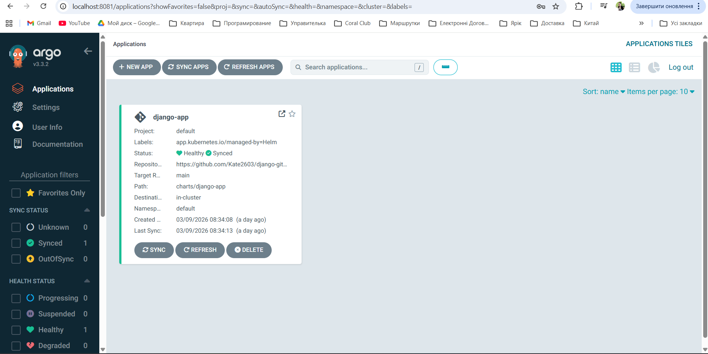

kubectl port-forward svc/kube-prometheus-stack-grafana 3000:80 -n monitoring

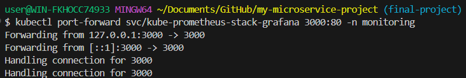

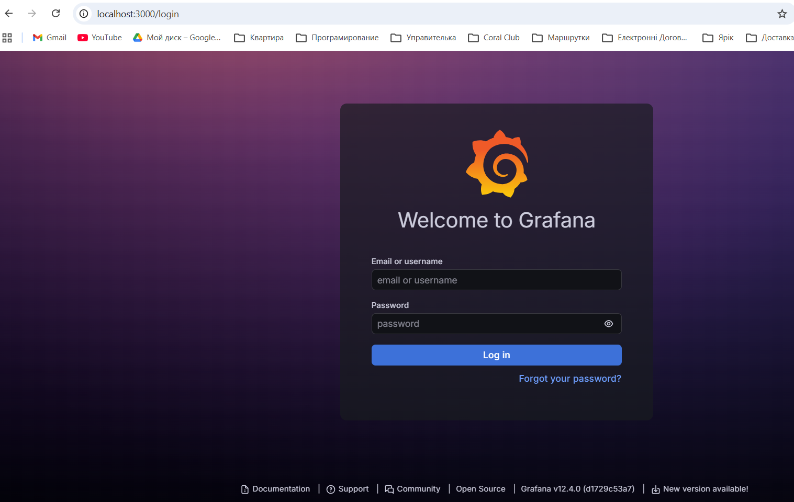

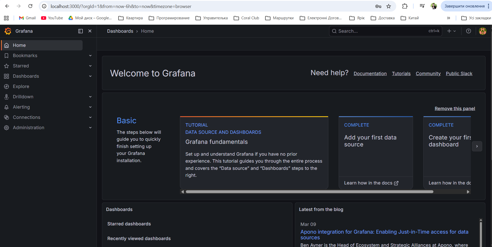

kubectl port-forward svc/django-app-django-app 8000:8000 -n default

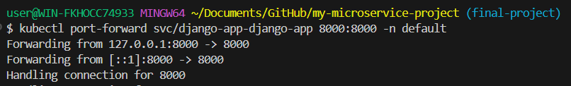

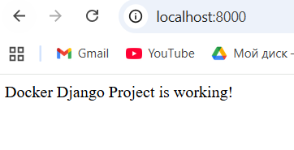

## Jenkins credentials

У Jenkins потрібно створити credential:

- ID: `github-https-creds`
- Type: Username with password
- Username: GitHub username
- Password: GitHub personal access token

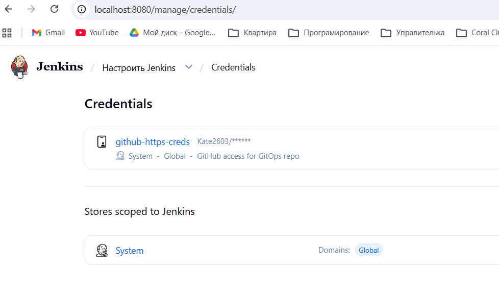

## Terraform destroy

Щоб уникнути витрат у AWS, після перевірки потрібно видалити інфраструктуру.

Спочатку видалити основну інфраструктуру:

terraform destroy

Потім видалити Terraform backend:

cd bootstrap
terraform destroy
