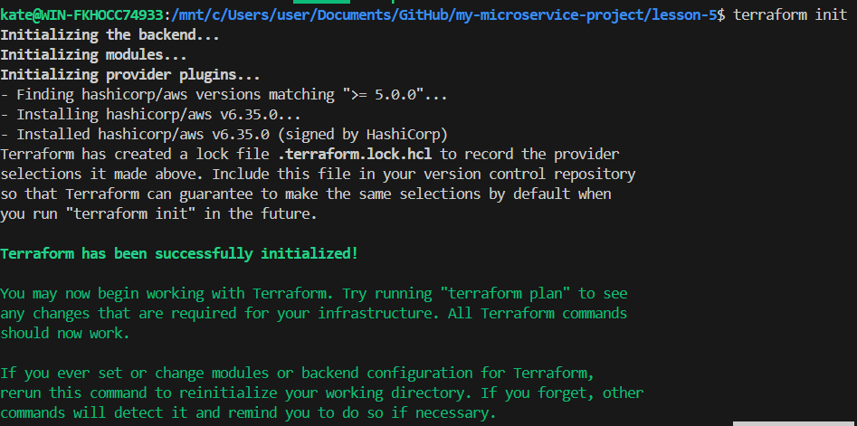
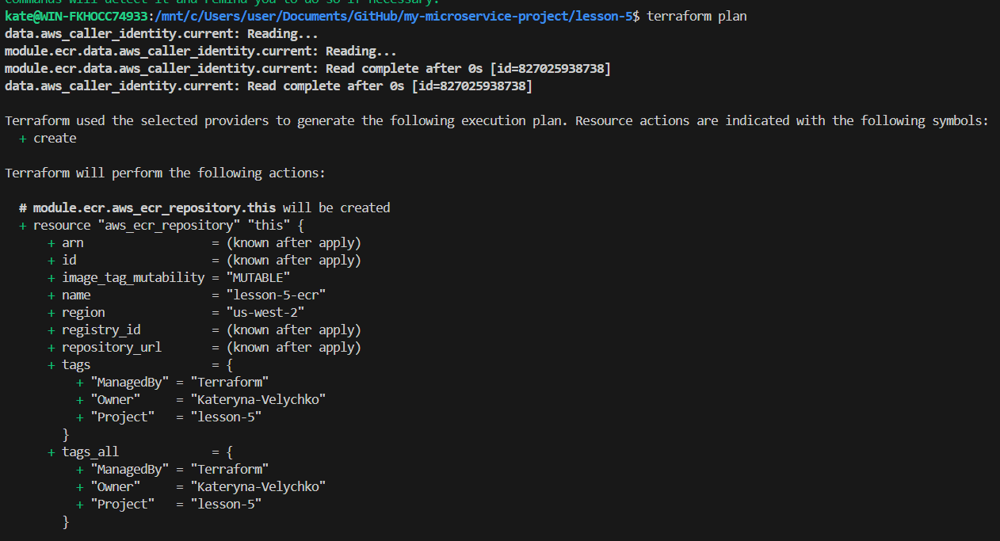
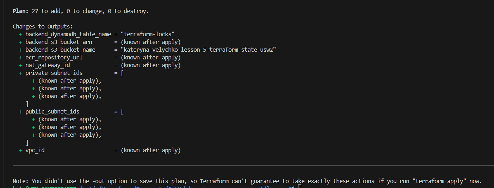
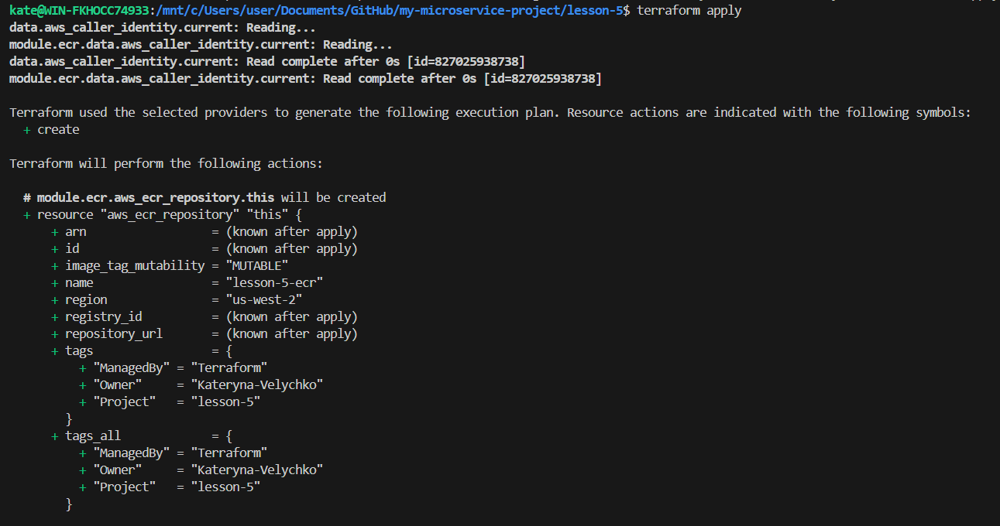
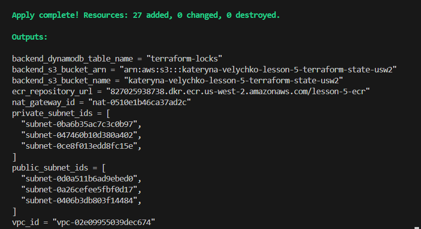

# Lesson 5 — IaC (Terraform) on AWS: S3 Backend + VPC + ECR

Цей проєкт створює базову інфраструктуру в AWS за допомогою Terraform:

- S3 bucket для зберігання Terraform state (з версіюванням та шифруванням)
- DynamoDB table для блокування state (state locking)
- VPC з 3 public та 3 private підмережами, Internet Gateway, NAT Gateway та маршрутизацією
- ECR repository для Docker-образів зі скануванням image scan on push та policy доступу

## Структура проєкту

lesson-5/
├── main.tf
├── backend.tf
├── outputs.tf
├── modules/
│ ├── s3-backend/
│ │ ├── s3.tf
│ │ ├── dynamodb.tf
│ │ ├── variables.tf
│ │ └── outputs.tf
│ ├── vpc/
│ │ ├── vpc.tf
│ │ ├── routes.tf
│ │ ├── variables.tf
│ │ └── outputs.tf
│ └── ecr/
│ ├── ecr.tf
│ ├── variables.tf
│ └── outputs.tf
└── README.md

## Модулі

### 1) modules/s3-backend

Створює:

- S3 bucket для Terraform state:
  - Versioning = Enabled
  - SSE (AES256) = Enabled
  - Public access block = Enabled
- DynamoDB table для блокування (LockID як hash key)

Outputs:

- S3 bucket name/arn
- DynamoDB table name

### 2) modules/vpc

Створює:

- VPC
- 3 public subnets + 3 private subnets (по AZ)
- Internet Gateway
- 1 NAT Gateway (економний варіант)
- Route tables + associations

Outputs:

- VPC ID, subnet IDs, IGW ID, NAT GW ID

### 3) modules/ecr

Створює:

- ECR repository (scan_on_push за бажанням)
- Repository policy (доступ для root поточного AWS акаунта)

Outputs:

- repository_url, repository_arn

## Запуск ## Description

This Terraform project creates AWS infrastructure including:

- S3 bucket for Terraform state storage
- DynamoDB table for state locking
- VPC with public and private subnets
- Internet Gateway
- NAT Gateway
- Route tables
- ECR repository for Docker images

## Commands

Initialize project

terraform init

Preview changes

terraform plan

Apply infrastructure

terraform apply

Destroy infrastructure

terraform destroy

## Modules

### s3-backend

Creates S3 bucket and DynamoDB table for Terraform state management.

### vpc

Creates VPC network with public and private subnets, IGW, NAT Gateway and route tables.

### ecr

Creates ECR repository with image scanning enabled.
