# Microservice Infrastructure Deployment (Lesson 7)

This project demonstrates deployment of a **Dockerized Django application** into **AWS EKS** using **Terraform (Infrastructure as Code)** and **Helm**.

The infrastructure and application are deployed automatically using modern DevOps practices.

---

# Architecture

The project uses the following components:

- AWS EKS (Kubernetes cluster)
- AWS ECR (Docker image registry)
- Terraform (Infrastructure as Code)
- Helm (Kubernetes package manager)
- Kubernetes (Deployment, Service, ConfigMap, HPA)
- Docker (containerization)

Architecture flow:

Developer → Docker build → Push image to ECR → Helm deploy → Kubernetes (EKS)

---

# Project Structure

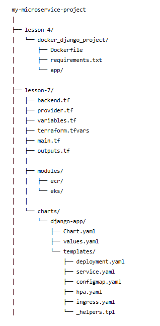

---

# Infrastructure Provisioning

Infrastructure is provisioned using Terraform.

Initialize Terraform:

terraform init

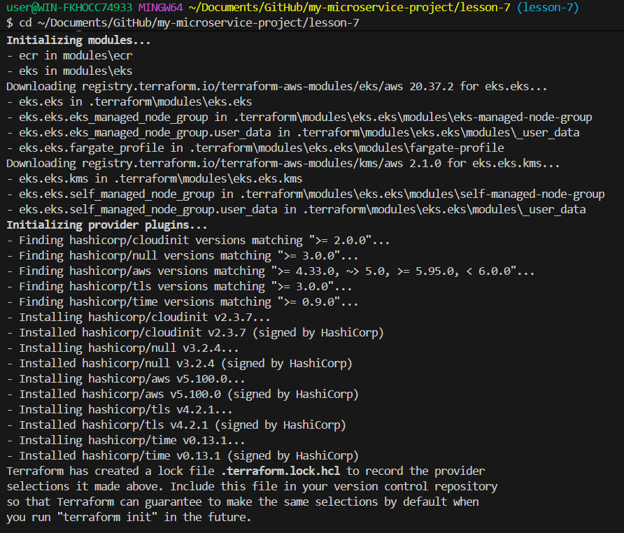

Preview infrastructure changes:

terraform plan

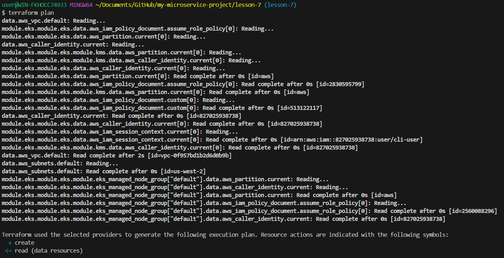

Apply infrastructure:

terraform apply

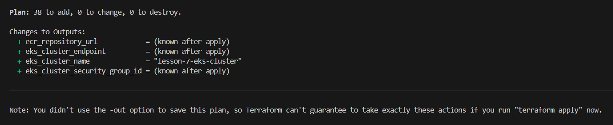

Terraform provisions:

- AWS ECR repository
- AWS EKS cluster
- IAM roles
- Security groups
- Node group

---

# Docker Image Build

Navigate to the Django project directory:

cd lesson-4/docker_django_project

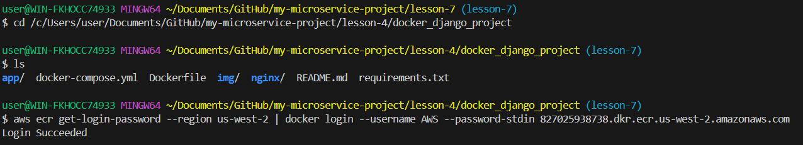

Build Docker image:

docker build -t lesson-7-django-app:latest .

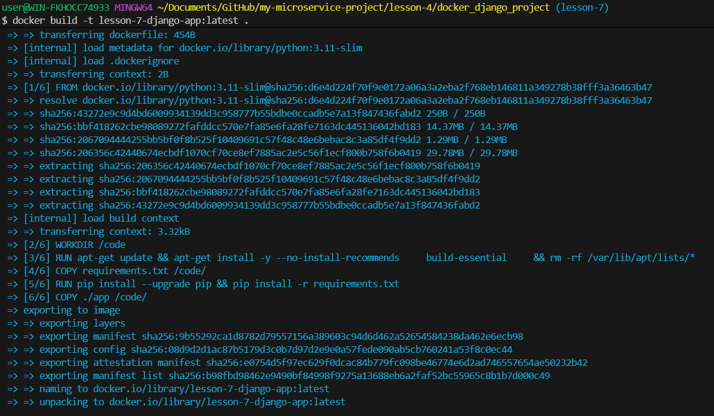

Login to AWS ECR:

aws ecr get-login-password --region us-west-2 \
| docker login \
--username AWS \
--password-stdin 827025938738.dkr.ecr.us-west-2.amazonaws.com

Tag the image:

docker tag lesson-7-django-app:latest \
827025938738.dkr.ecr.us-west-2.amazonaws.com/lesson-7-django-app:latest

Push image to ECR:

docker push \
827025938738.dkr.ecr.us-west-2.amazonaws.com/lesson-7-django-app:latest

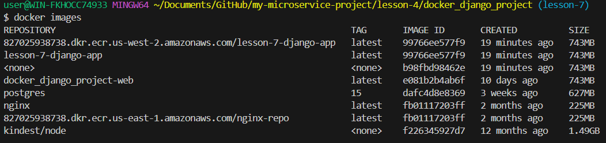

---

# Kubernetes Deployment (Helm)

Deploy application using Helm:

helm upgrade --install django-app charts/django-app

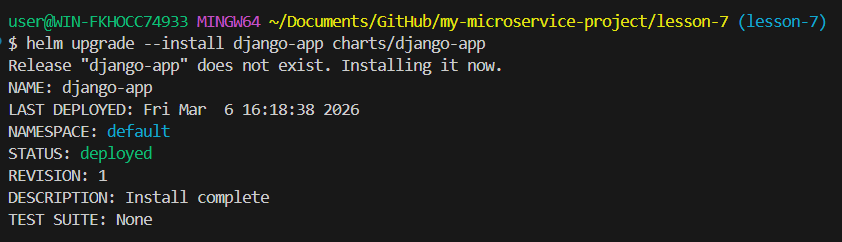

Helm deploys:

- Deployment
- Service (LoadBalancer)
- ConfigMap
- HorizontalPodAutoscaler

---

# Kubernetes Resources

Check pods:

kubectl get pods

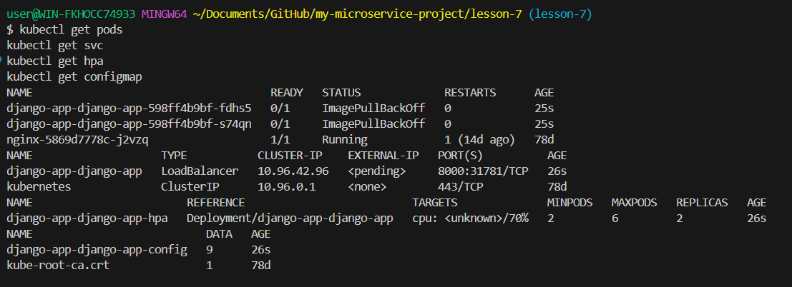

Check services:

kubectl get svc

Check autoscaler:

kubectl get hpa

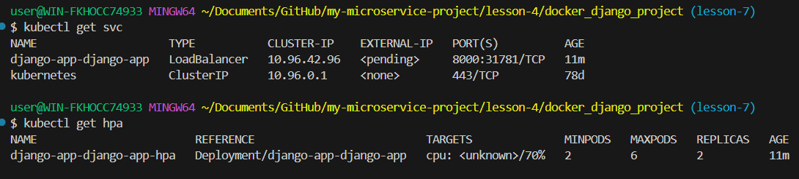

Check config maps:

kubectl get configmap

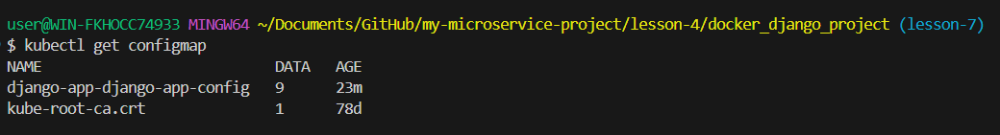
