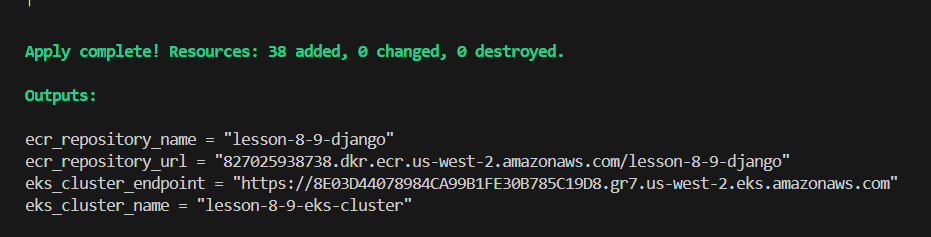
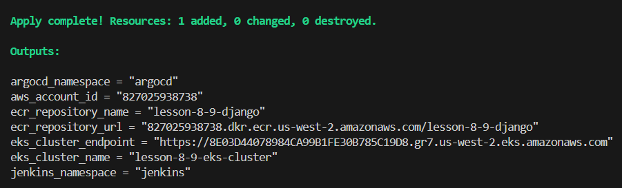
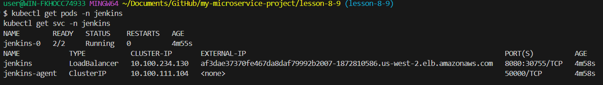
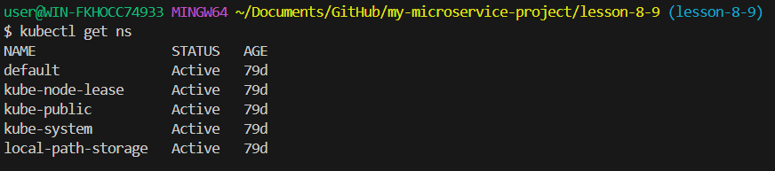
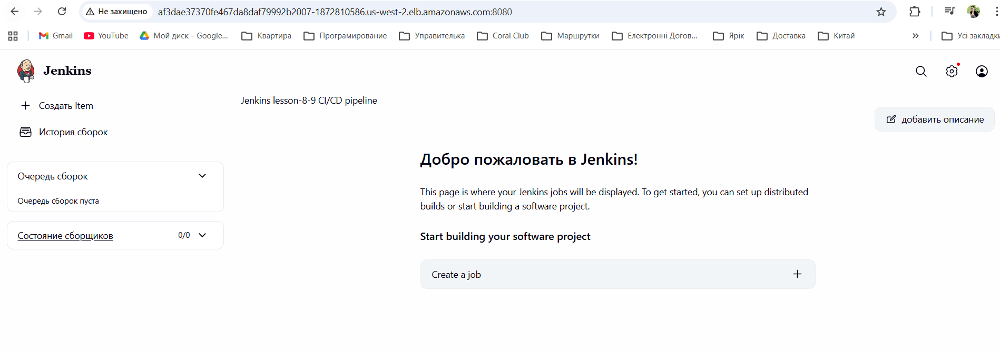

# Microservice Infrastructure Deployment (Lesson 7)

terraform fmt -recursive
terraform init -reconfigure
terraform validate
terraform apply -target=module.ecr -target=module.eks -auto-approve

terraform apply -auto-approve

kubectl get pods -n jenkins
kubectl get svc -n jenkins

kubectl get ns

Заходимо на jenkins

http://af3dae37370fe467da8daf79992b2007-1872810586.us-west-2.elb.amazonaws.com:8080/

