# Lesson 8–9 — CI/CD Pipeline with Jenkins, ECR, EKS and Argo CD (GitOps)

This project demonstrates a complete **CI/CD pipeline using Jenkins, AWS ECR, Amazon EKS and Argo CD with a GitOps workflow**.

The pipeline automatically:

1. Builds a Docker image of a Django application
2. Pushes the image to AWS ECR
3. Updates the GitOps repository with a new image tag
4. Argo CD automatically deploys the new version to Kubernetes

---

# Architecture

GitHub (Application Repo)
|
v
Jenkins
|
v
Build Docker Image
|
v
AWS ECR
|
v
Update GitOps Repo
|
v
Argo CD
|
v
Amazon EKS
|
v
Running Django App

---

# Infrastructure

The infrastructure was provisioned using **Terraform**.

## Terraform Apply Output

Infrastructure created:

- Amazon EKS Cluster
- AWS ECR Repository
- Jenkins Namespace
- Argo CD Namespace

Example Terraform outputs:

ecr_repository_name = "lesson-8-9-django"
ecr_repository_url = "827025938738.dkr.ecr.us-west-2.amazonaws.com/lesson-8-9-django"
eks_cluster_name = "lesson-8-9-eks-cluster"

# Kubernetes Cluster

After provisioning the infrastructure, the Kubernetes cluster is accessible.

## Namespaces

kubectl get ns

# Jenkins Deployment

Jenkins runs inside Kubernetes.

## Jenkins Pod

kubectl get pods -n jenkins

## Jenkins Service

kubectl get svc -n jenkins

The Jenkins UI is accessible via LoadBalancer.

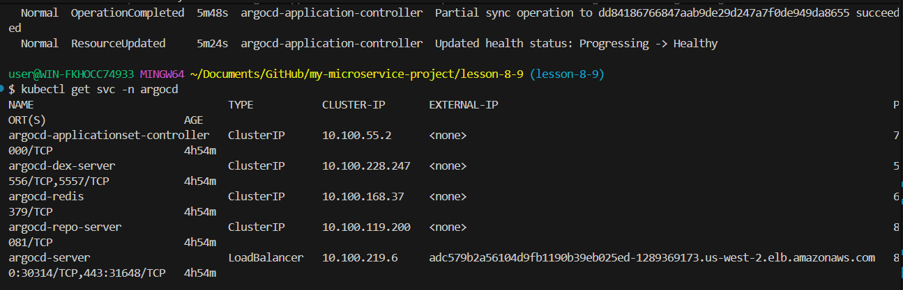

## Jenkins Dashboard

# Jenkins Credentials

GitHub credentials were added to allow Jenkins to push updates to the GitOps repository.

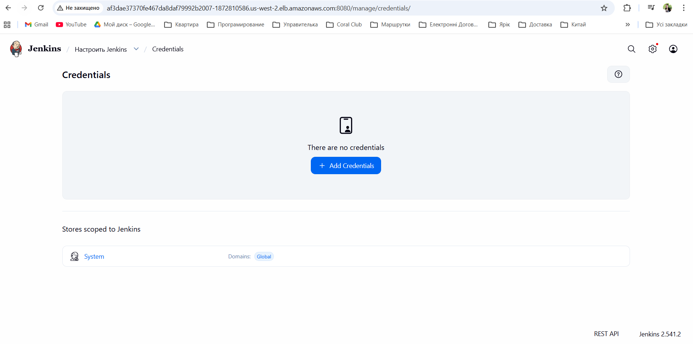

Credential ID used in the pipeline:

github-https-creds

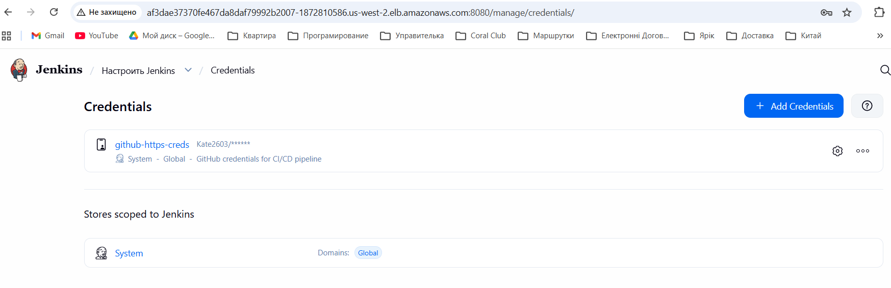

# Jenkins Pipeline

The pipeline performs:

1. Checkout application repository
2. Build Docker image
3. Push image to AWS ECR
4. Update GitOps repository with a new image tag

Pipeline execution example:

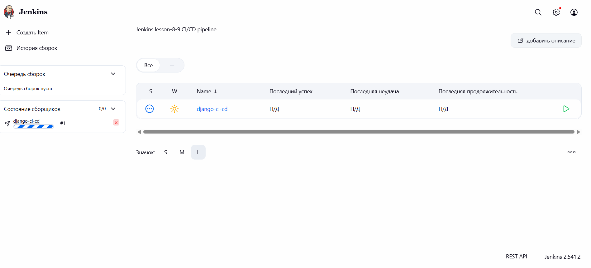

The pipeline finished successfully:

Finished: SUCCESS

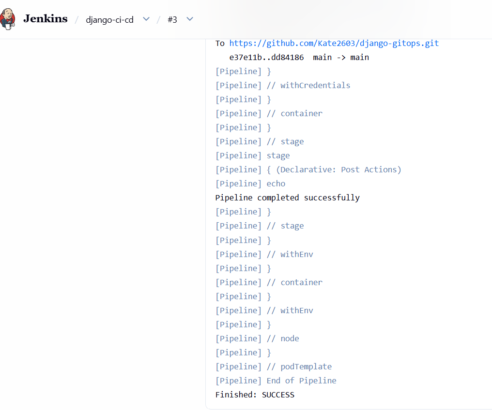

# GitOps Repository

The GitOps repository stores Kubernetes manifests and Helm charts.

Repository:

https://github.com/Kate2603/django-gitops

## Helm Chart

charts/django-app

Image configuration:

image:
repository: 827025938738.dkr.ecr.us-west-2.amazonaws.com/lesson-8-9-django
tag: "e3046e2"

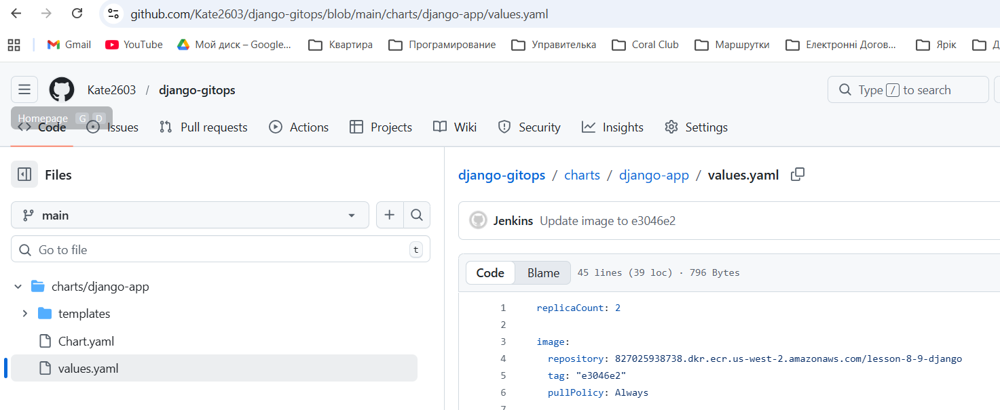

# Automatic GitOps Update

When Jenkins builds a new image, it updates the Helm values file automatically.

Example commit created by Jenkins:

Update image to e3046e2

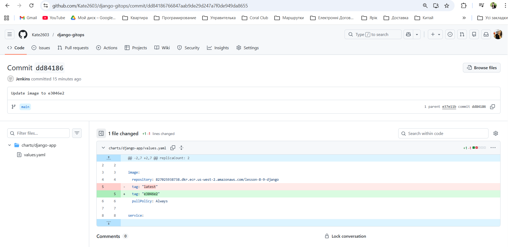

# Argo CD Deployment

Argo CD monitors the GitOps repository and automatically deploys updates.

## Applications

kubectl get applications -n argocd

Output:

django-app Synced Healthy

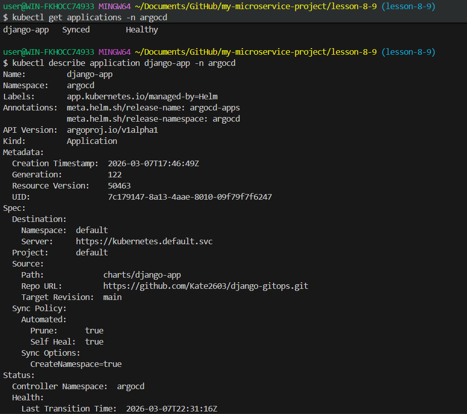

# Argo CD Application Details

kubectl describe application django-app -n argocd

Important configuration:

Repo URL: https://github.com/Kate2603/django-gitops.git

Path: charts/django-app
Target Revision: main
Sync Policy: Automated
Self Heal: true
Prune: true

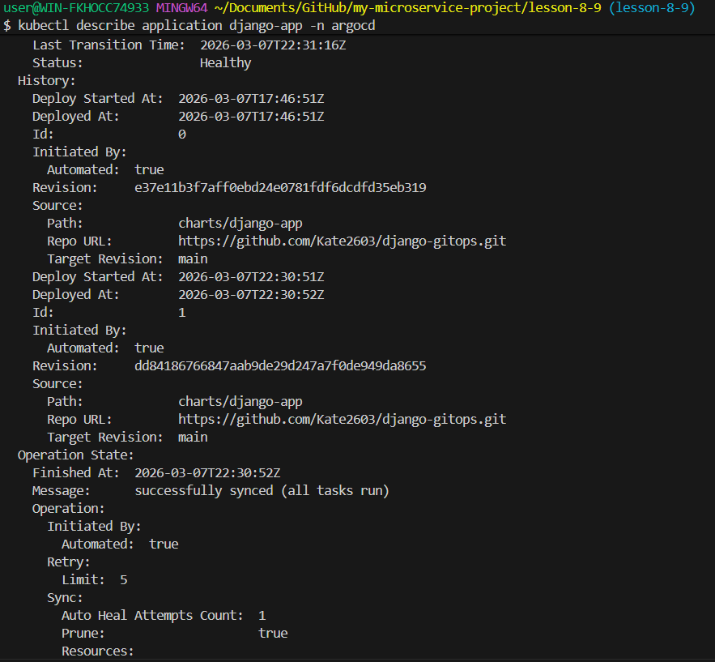

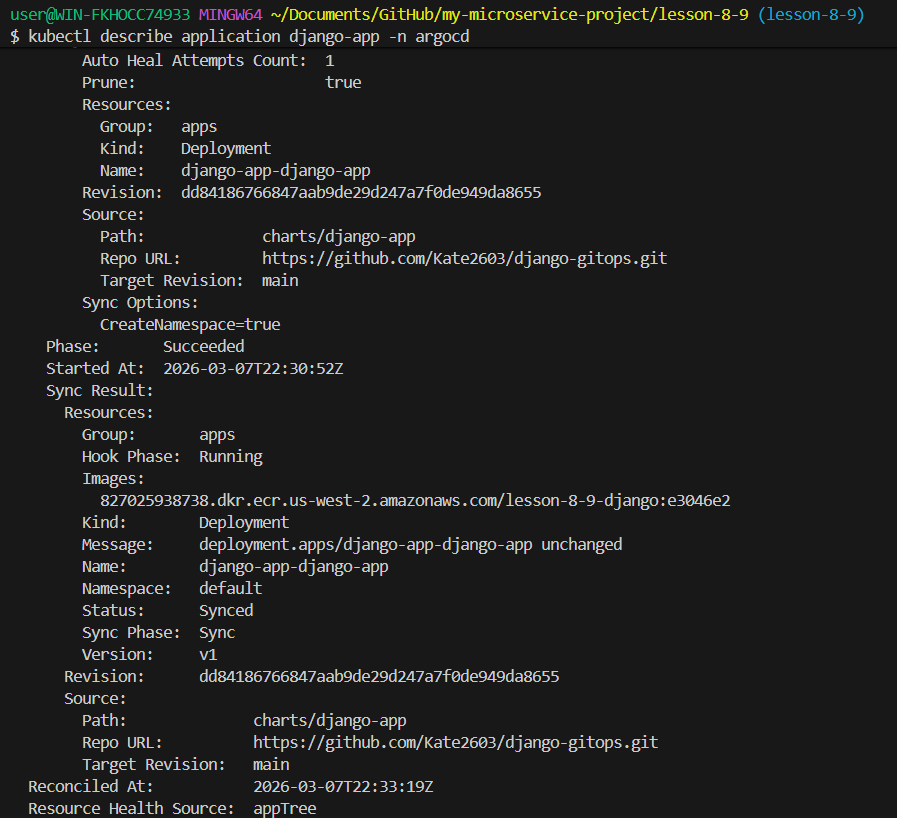

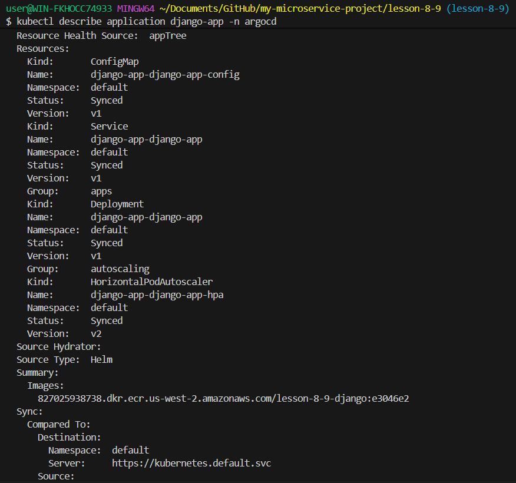

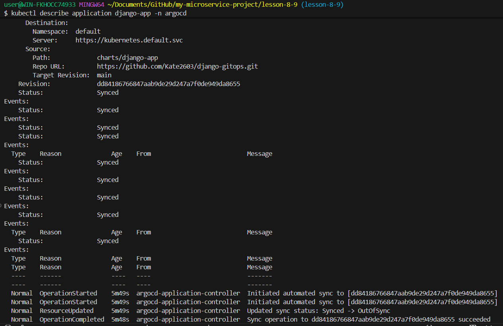

# Deployment Result

The deployed container image:

827025938738.dkr.ecr.us-west-2.amazonaws.com/lesson-8-9-django:e3046e2

Argo CD status:

Synced
Healthy

This confirms that the **GitOps workflow successfully deployed the application to Kubernetes.**

---

# CI/CD Flow Summary

1️⃣ Code pushed to GitHub  
2️⃣ Jenkins pipeline starts  
3️⃣ Docker image built using Kaniko  
4️⃣ Image pushed to AWS ECR  
5️⃣ Jenkins updates GitOps repository  
6️⃣ Argo CD detects changes  
7️⃣ Argo CD deploys application to EKS

---

# Technologies Used

- AWS EKS
- AWS ECR
- Terraform
- Kubernetes
- Jenkins
- Kaniko
- Argo CD
- Helm
- GitOps
- Docker
- Django
