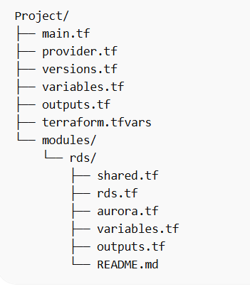
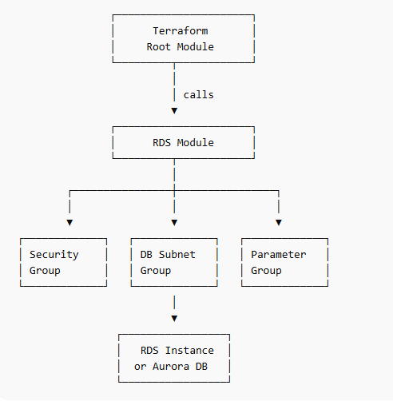
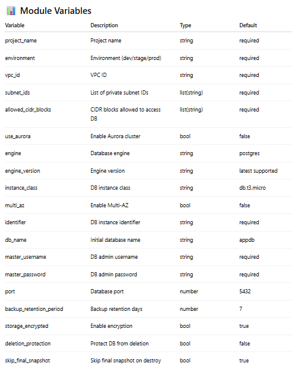
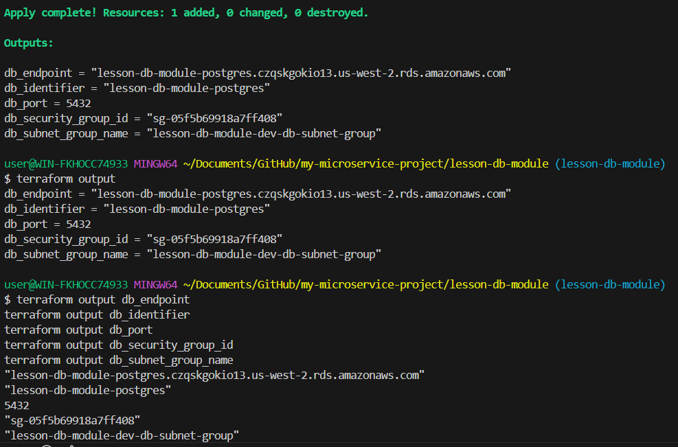

# Terraform Universal RDS Module

Overview

This project implements a flexible and reusable Terraform module for provisioning relational databases in AWS.

The module supports two deployment modes controlled by the variable:

use_aurora

Depending on this flag, the module can create either:

1️⃣ Standard RDS Instance (PostgreSQL / MySQL)
2️⃣ Amazon Aurora Cluster

The module automatically provisions all required infrastructure components:

DB Subnet Group

Security Group

Parameter Group (for RDS)

Cluster Parameter Group (for Aurora)

This design allows the same module to be reused across multiple environments such as dev, staging, and production.

## Project Structure

## Architecture

The Terraform module provisions AWS infrastructure components required for relational databases.

Infrastructure components created:

- Amazon RDS Instance or Aurora Cluster
- DB Subnet Group
- Security Group
- DB Parameter Group

Architecture diagram

## Module Features

The RDS module automatically provisions:

✔ DB Subnet Group
✔ Security Group
✔ Parameter Group
✔ Aurora Cluster (optional)
✔ RDS Instance (optional)

Deployment logic:

Variable Result
use_aurora = true Creates Aurora Cluster
use_aurora = false Creates standard RDS instance

## Example Usage

Deploy Standard RDS (PostgreSQL)
module "rds" {
source = "./modules/rds"

project_name = "lesson-db-module"
environment = "dev"

vpc_id = "vpc-xxxxxxxx"

subnet_ids = [
"subnet-xxxxxxxx",
"subnet-yyyyyyyy"
]

allowed_cidr_blocks = [
"172.31.0.0/16"
]

use_aurora = false

engine = "postgres"
engine_version = "16.13"
instance_class = "db.t3.micro"
multi_az = false

identifier = "lesson-db-module-postgres"

db_name = "appdb"
master_username = "postgresadmin"
master_password = "StrongPassword123!"

port = 5432

parameter_group_family = "postgres16"
cluster_parameter_group_family = "aurora-postgresql16"

backup_retention_period = 7
storage_encrypted = true
deletion_protection = false
skip_final_snapshot = true

aurora_instance_count = 1

tags = {
Project = "lesson-db-module"
Environment = "dev"
ManagedBy = "Terraform"
}
}

## Example: Deploy Aurora Cluster

To deploy Aurora instead of RDS, change the flag:

use_aurora = true

Example:

module "rds" {

use_aurora = true

engine = "aurora-postgresql"
engine_version = "16.1"
instance_class = "db.t3.medium"

}

Terraform will automatically create:

aws_rds_cluster

aws_rds_cluster_instance

aws_rds_cluster_parameter_group

## Module Variables

### Outputs

The module exports the following outputs:

Output Description
db_endpoint Database endpoint
db_identifier DB instance identifier
db_port Database port
db_security_group_id Security group ID
db_subnet_group_name DB subnet group

Example:

terraform output

Output example:

db_endpoint = lesson-db-module-postgres.xxxxx.us-west-2.rds.amazonaws.com
db_identifier = lesson-db-module-postgres
db_port = 5432
db_security_group_id = sg-xxxxxxxx
db_subnet_group_name = lesson-db-module-dev-db-subnet-group

### How to Run

Initialize Terraform
terraform init
Validate configuration
terraform validate
Preview infrastructure
terraform plan
Apply infrastructure
terraform apply

### Destroy Infrastructure

To avoid unnecessary AWS costs, destroy resources after testing:

terraform destroy

### Key Concepts Implemented

This project demonstrates several Terraform best practices:

✔ Modular infrastructure design
✔ Conditional resource creation
✔ Reusable infrastructure components
✔ Environment-agnostic configuration
✔ Secure infrastructure provisioning

### Result

The Terraform module successfully provisions:

PostgreSQL RDS instance

Aurora cluster (optional)

Networking components

Database parameter groups

The infrastructure was tested by deploying a PostgreSQL RDS instance in AWS and retrieving connection outputs via Terraform.
